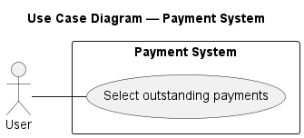
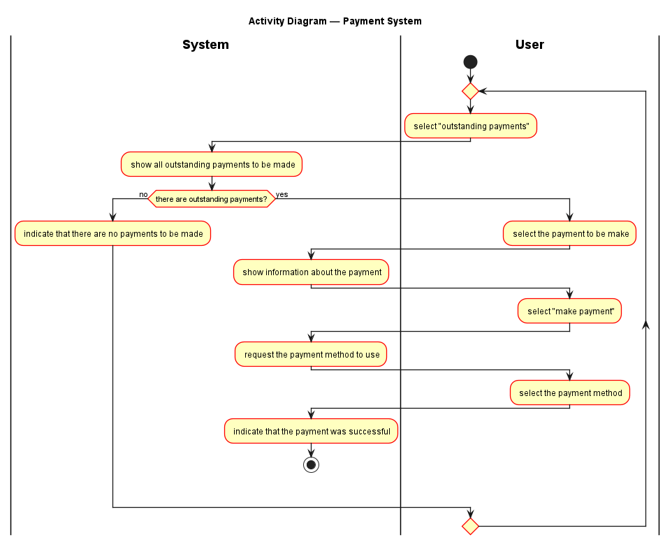
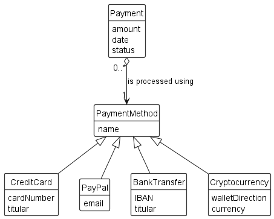
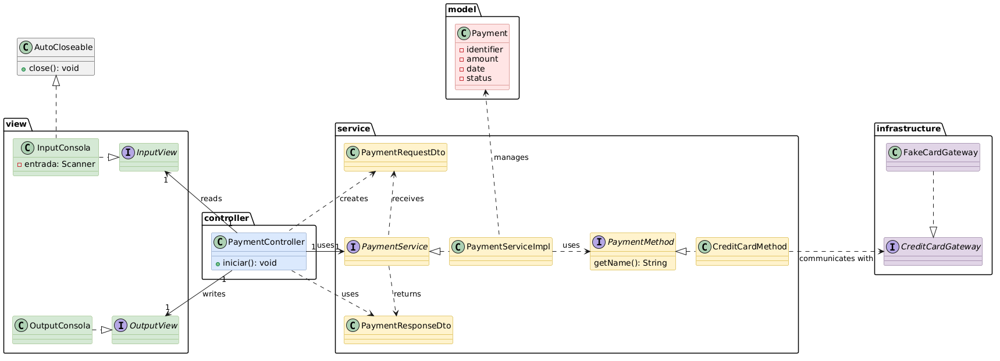

# 01 - Payment System


-lightgrey)


A clean-architecture payment processing system built in Java.

## Table of Contents

- [Features](#features)
- [Exercise Brief](#exercise-brief)
- [Technologies](#technologies)
- [Project Structure](#project-structure)
- [Diagrams](#diagrams)
    - [Use Case Diagram](#use-case-diagram)
    - [Activity Diagram](#activity-diagram)
    - [Class Diagrams](#class-diagrams)
- [Patterns and Principles Applied](#patterns-and-principles-applied)
- [Author](#author)

## Exercise brief

> <hr>
>  
> ### Context
> 
> An e-commerce platform requires a system to process payments.
> At present, it only accepts card payments, but the business intends to introduce additional payment methods in the future.
> 
> ### Initial Requirements
> 
> - A customer must be able to make a payment.
> - Each payment must include:
>     - Identifier
>     - Amount
>     - Date
>     - Status
> - The system must support card payments.
> 
> 
> ### New Requirements
> 
> The business has requested the following enhancements:
> 
> - Add support for payments made via:
>     - PayPal
>     - Bank transfer
>     - Cryptocurrency
> - Record additional information depending on the payment method used.
> - Allow payments to be cancelled.
> - Introduce an audit system to log payment operations.
> 
> 
> ### Objective
> 
> Design a system in which adding new payment methods does not require modifications to the core application.  
> <hr>

## Technologies

- Java 21 
- Without frameworks (pure Java)

Built using pure Java without external dependencies.

## Project Structure

- `application/` — application entry point and initialization components
- `model/` — domain entities and business concepts
- `service/` — application logic and payment processing services
- `infrastructure/` — external integrations and technical implementations
- `view/` — user interface components for input and output handling
- `controller/` — coordinates user interactions and application flow

```
src/
└── dev/wcortiz/paymentsystem/
    ├── application/
    |   ├── Main.java
    │   └── PaymentSeeder.java
    ├── controller/
    │   └── PaymentController.java
    ├── infrastructure/
    │   ├── CreditCardGateway.java
    │   └── FakeCardGateway.java
    ├── model/
    │   └── Payment.java
    ├── service/
    │   ├── CreditCardMethod.java
    │   ├── PaymentMethod.java
    │   ├── PaymentRequestDto.java
    |   ├── PaymentResponseDto.java
    |   ├── PaymentService.java
    |   └── PaymentServiceImpl.java
    └── view/
        ├── InputView.java
        ├── InputConsola.java
        ├── OutputView.java
        └── OutputConsola.java
```

## Diagrams

### Use Case Diagram

Interactions between the customer and the system, covering all supported payment operations.



> **Resources:** 
[`PlantUML source`](./docs/diagrams/01-use-case-diagram/use-case-diagram.puml) · 
[`Edit online`](https://www.plantuml.com/plantuml/uml/LOzD2i8m48NtSuf7zbruWq8zW51wWA4POo0_aamNHGGFuGazYObTkNamy7t3UsDLBhh5WAtAi78BwzaLZaH1hWhDADxT5DONMTNdHAHUWs2fWebRd0y1dzSR5zwZ9CMyLvL8nAlcqj52r7rEhgdc7pDu481UeJU0cIKq5ddJsWphayFzCAe1LopJYPv4_Is6uNVIACcs7Ly0) · 
[`Descriptive sheets (PDF)`](./docs/diagrams/01-use-case-diagram/descriptive-sheets/use-case-sheets.pdf)

### Activity Diagram

Flow of the payment processing operation, including validation, processing, and error handling.




> **Resources:** 
[`PlantUML source`](./docs/diagrams/02-activity-diagram/activity-diagram.puml) · 
[`Edit online`](https://www.plantuml.com/plantuml/uml/XLFTRjCm5BxtKtmA5sqlHWVSqMciR1HnWJJHyG1kSjfOTUnYdwogA18FmHFo93X9qth8tSvLhFFzdC_nkV4i7TULXinPFIhUNHHAhfoiX1WFBfA5EUyqUIHQWx4GVgtCHWO5pBUgqjBGWs9DCsku9M9XTH6XfWVZZp9VhvojJN5hjNLuDGjrUvb2MbUGEw8kGyKev-pseLJvsf3tUFFwxLc96FNk_y2OMOTxwnKhQvHPuPEcYWnxd0tSto5-2Y2QykfAcKVbrKBJzJMsfM9g077WDEZNkR-0ko_Jpz-cNv5gDaDnS-V8-houw_ug_lx-WtkvQu9WllDCLIR4lllQXw_ldjmUedqMGZZQa6I1KE_XILFEo6pDeMsAvausdPJF9g95zKheEQNTGcgD50biiI1Kig03NIqnv98SGJfASZwC4006GsD7BQNpKG6LIwRGb8oJXB5fDuGYxGd37VcJK1U_EyQPWs2lSvHPzqD7kJjg55sPfNMLR9uGv284YgKcuaNZBFWSyTdpXev-rEIV3biHbxPePguzlUYNugOzq_SUixVImzTvJjulQnsfUBQRqsayY5UC3Yis69yy9dYw6STEGIppiZrI66CfH9IiUxdD6cd2S3GHDm5JL_eV)

### Class Diagrams

#### Conceptual Class Diagram

Overview of the business domain entities and their relationships, independent of any technical implementation.



> **Resources:** 
[`PlantUML source`](./docs/diagrams/03-class-diagrams/conceptual-class-diagram/conceptual-class-diagram.puml) · 
[`Edit online`](https://www.plantuml.com/plantuml/uml/VL1TRvj047o_Nx4Y3v4gOINAMrLLmPWeg3OWmn_Otctj4t27xkF1RVFVImuZ6cHbdcwP7MPcdwr3utpV0TUAq-0yTZ7lqDfOI3mPx1cxZoV0QxxB8DjdXwneoXgIOWVrZxoeacDoW7Z6FMEsbMh0KGpXLubpHlxqZlBHf9Q_2HxMArjj19dcB7cho5fut3mnTfQ2e2Ttri9E0vU6TxH4cW1fkI-FiCjUyY9lyhAuXlaa4lnXC6ABl3qPxPL8TQSDtBq4J5o8D7r_nzrJ07jRsSyNgJyFCDbMUEb9kQizzgEr2q-1ZiB3EdJUihULuX3ESDKfx6dPI0q9wL8quZzDXTqyRL6rZK5bVv5PD9V1QUwD8SKlwuF6SCpsoNkH-ZMlwdMRq6Tk4ZriDbyYq77y7QB7Q9NtAqWBWz6Sh2K1tafrOkpZphU_e-5IuXOx5Rh1V2XtYryNVIObVD_z0m00)

#### Implementation Class Diagram

Detailed view of the application's technical implementation, showing the MVC architecture, service layer, payment method strategies, infrastructure components, and the relationships between interfaces and concrete implementations.



> **Resources:** 
[`PlantUML source`](./docs/diagrams/03-class-diagrams/implementation-class-diagram/implementation-class-diagram.puml) · 
[`Edit online`](https://www.plantuml.com/plantuml/uml/ZLHHSzeu47xNhz3G1-wc0stQaAIT35DYJCup16SWbyuzwgm5DB4bJfB3PIxzx-SrTcGZCwsVGFhsszrlLzytOvcsUPPIaUrIo41QPeMIWoHbnWouO1lDCaAsWWCr5ZGe-x83Glg3euy6yJp-SxcYqt0MBQA7A5xGWVVr2J5FGkvOmKhB7FG_GellXYLF6wrooGELAdrzdIXfjKfJqECnVJUTX5Upu81KceFkGk7txkBprTbaHhf9dmNiIxfHU3Kzz-dmlYQwd4w2YqydY3B58KMcsImSXHwJ0vHKDrUZyz774rG6zBD80CdMw_NdXFja3bBI9UTVsCTJT9pLTLq4lc1uNTDCBx_SdAGHSgsPiJfFRAxBuiApGhLBZz53LcDOZyuk4_A3TArAE0_lmiN3ptUb_nY5tsdANa0N_tP5aMm3j8TZwbMB8wG5lMO9q4ZkSljOND5wa8GSGUBSUXY4LAjOCWHA6fMoDq2L1xy11Maru-mhNILCIj3brOyc1wRmIGw83_rxPGI-Bo4t50xlpVG_DC8d-RyY5KpJygnyTlKHYjc_YwVXt5UaN3UKn37TinUafsuNcuqKnDAAjG3TE6IPogLj771ceV7NM6PpK_MCrQp2vMCKX7uzrSRwGwggMXtkQMEt_T8hK5GuKmlOJNa7Tgku0xOQte1Ti0n--xsOdDM5-lxW0WrSs81fxZCHlxWbc9sI1gPMDP5Tm7zoCFOOX_85yU9X6S_duT9Nq3bRvrY3jsjwv8AkwVTKI948fh7jPoLuOtAtauVm--GlFs_xEVi3T3BTCWjxza9z2sYKEsDFy1CmbXFRBMXJr56_0gk2L1bWVwTGbV2U9dXIzu9XxIVpYRIUooVFUUWiNjBxU5KQJhIuTJxaEuypam5NUpbmhx3-KLyuJo747yuWXRLjH9EtygfuVqr-1TALATyD6iqtMRJOREqR3UhYVtGPpYSepEgFwBvMn3Tax1FbQJhbCDyDNyVjeJKLl7uTeWf3semYJZS7Q9bdbOqooQdhiz_LU--iLoazBd-xt5zfJmFZfdSg2XMkeZ2x2zjhOQ688_tAXp2p_wI7I30yzhKoRGBY6HcExWuHuouZASDihYNcROUXIEKSXntsIFmZMg77RN_45Baf-sgTEthF29q2lp8AN8Qnlx6ODz70B9mU1UQl9-ZhcPlkKDUdfwSBQxTmfpYaVTAfMhDyZC-OP9i3HTHohYA-mmjVaU3OzOxI-pn7YhkU_0oeeygoN8e4nQHxORT5STz0yZnB_mS0)

## Patterns and Principles applied

- MVC pattern
- SOLID principles
- Service layer with rich model

## Author

Developed by **Wilson Camilo Ortiz Miño**

[](https://github.com/wcortiz)
[](https://www.linkedin.com/in/wilson-camilo-ortiz-mi%C3%B1o-b88282419/)